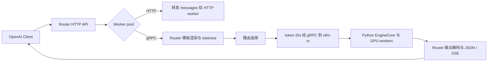

# 2026 年 9 月 vLLM Router 变更阅读记录

整理日期：2026-10-07。研究仓库：[vLLM Router](https://github.com/vllm-project/router)。

## 1. 时间与统计口径

- 统计范围为 **2026 年 9 月**，采用 GitHub 的 **PR 合并时间（UTC）**：`2026-09-01 00:00:00 ≤ merged_at < 2026-10-01 00:00:00`。表格日期均为 UTC 月日，不代表版本发布日期。
- 检索 vllm-project/router 当月全部已合并 PR，共 **21 项**，并通过 GitHub REST 返回的 `pull_request.merged_at` 核对日期；对 Program 调度与 gRPC 后端进一步阅读 PR diff。
- 产品能力、问题修复与工程维护分别记录。模型内部的 MoE 专家路由不属于本目录范围。
- 已合并不等于已包含在安装包或镜像中。测试结果引用 PR 作者记录，本次没有运行服务复现。

复查入口：[Router 九月已合并 PR](https://github.com/vllm-project/router/pulls?q=is%3Apr+is%3Amerged+merged%3A2026-09-01..2026-09-30)。

## 2. 主要结论

| 主题 | 九月变化 | 阅读或升级时的关注点 |
| --- | --- | --- |
| Router | 新增 WASM OnRequest、Program Progress-TTL、Rust gRPC 后端、NIXL push 并发 P/D | Program 调度需要显式启用；gRPC 后端本次仍不支持主动工具调用 |
| Router 修复 | DP `@rank` GET 代理、重复响应头、Unicode stop 检查及 reasoning effort 兼容 | 多卡代理、非 ASCII 输出、客户端 API 兼容是本月明确修复点 |

## 3. vLLM Router：新特性

### 3.1 WASM 可插拔 OnRequest 中间件

**09-16：[PR #251](https://github.com/vllm-project/router/pull/251)** 引入 Wasmtime host 和 `vllm:router-middleware@0.1.0` WIT。通过 `--wasm-middleware`、`--wasm-middleware-sha256`、`--wasm-middleware-route` 配置；默认接入点为 `POST /v1/chat/completions`，显式启用，未支持的 route 启动时拒绝。

中间件在请求到 worker 前修改或拒绝请求，提供摘要 pinning、有界 worker/queue 和 fail-closed 错误处理。附带示例 guest；测试覆盖修改、拒绝及路径隔离。它是请求进入阶段的插件机制，不代表已经提供任意响应阶段 hook。[PR #251](https://github.com/vllm-project/router/pull/251)

### 3.2 有界 tokenizer L0 编码缓存

**09-18：[PR #270](https://github.com/vllm-project/router/pull/270)** 新增 `CachedTokenizer`，对固定配置、确定性 tokenizer 的完全相同 encode 输入复用完整 Encoding。LRU 同时受 entry 数与估算字节上限约束，过大结果和错误不缓存，编码与克隆在锁外完成，提供命中、淘汰等指标。

**本次只加入库 wrapper，请求路径集成和 CLI 选项仍是后续工作。** 它不是 GPU KV cache，也不同于 gRPC 后端的“模型 → 已加载 tokenizer/frontend”对象缓存。batch encode、decode 和 metadata 调用仍透传。[PR #270](https://github.com/vllm-project/router/pull/270)

### 3.3 Program-level Progress-TTL 调度

**09-24：[PR #286](https://github.com/vllm-project/router/pull/286)** 把连续 `LLM → tool call → LLM` 交互作为一个 Program，在工具执行暂停期间利用连续性、重算成本与容量信息决定保留、恢复和放置请求，目标是降低短工具往返丢失可复用 KV 的概率。

主要组成：身份归一化（agentic_context、兼容 hints 和 headers）、Program registry、RequestPool、初始 Rank 绑定策略、容量/吞吐估计、Progress-TTL、避免饥饿的恢复机制、backend polling、诊断和 Prometheus 指标。默认 Rank 内恢复顺序为 MRU，可选 FCFS；跨 Rank 放置受全局队列和容量门控约束。[PR #286](https://github.com/vllm-project/router/pull/286)

启用边界来自 PR diff：Rust/Python CLI 都使用 `--enable-program-scheduling` 显式启用，`--program-scheduling-config-json` 可覆盖配置；不带启用开关却提供该 JSON 会被拒绝。未启用或没有支持的 Program 身份时回到原请求路由路径。成本模型系数需要结合模型、硬件和并行配置校准。[PR #286](https://github.com/vllm-project/router/pull/286)

**职责边界：调度器控制请求 admission 和 placement，不代表推理引擎已执行物理 KV eviction / offload / prefetch。** PR 明确将带执行反馈的 Router → engine KV 控制留待后续，不能把“TTL 到期”直接解释为 GPU KV 已释放。[PR #286](https://github.com/vllm-project/router/pull/286)

### 3.4 Rust gRPC Engine-Client 后端

**09-24：[PR #283](https://github.com/vllm-project/router/pull/283)** 新增面向同构 gRPC worker pool 的 Rust chat frontend：Router 应用模板并 tokenize，发送 token IDs 到 `vllm-rs` 的 Inference.GenerateStream，然后 detokenize 并转换为 OpenAI JSON / SSE。

Router 复用 vLLM 0.29.0 的 vllm-chat、vllm-tokenizer、vllm-text，使用 vllm-proto 0.2；不加载模型权重。token 预处理在 policy 前完成，重试复用 PreparedChat；gRPC worker 使用实际 gRPC health 探测。ZMQ 属于 vllm-rs 与 EngineCore 的内部边界，不是 Router 直接连接 EngineCore。[PR #283](https://github.com/vllm-project/router/pull/283)

| 当月后端支持边界 | 状态 |
| --- | --- |
| 文本生成、文本历史、已有工具调用/工具响应的模板渲染 | 支持 |
| tools + tool_choice=none 的历史表达 | 支持 |
| 主动 tool calling、reasoning_effort | 拒绝；diff 明确返回 400，等待输出 parser 接入 |
| 多模态、n>1、chat logprobs、请求级自定义模板、旧 functions/function_call | 此 gRPC 路径不支持 |
| HTTP / gRPC 混合 worker pool | 拒绝，要求同构 |
| token-aware prefix routing | 预处理边界已准备，本文所读 PR 没有完成该策略集成 |

以上限制见 [PR #283](https://github.com/vllm-project/router/pull/283) 的兼容性说明和请求校验 diff。**vLLM 自身新增 parser 并不意味着 Router gRPC 路径自动获得主动工具调用能力。** 使用该路径前还需确认 vllm-rs / Python EngineCore 发布线匹配。

### 3.5 NIXL push 模式支持与 P/D 时序改进

**09-24：[PR #187](https://github.com/vllm-project/router/pull/187)** 针对 NIXL push 改为并发发送 prefill 和 decode 请求，避免串行路径让 decode 登记总是落在 prefill 完成后、引入额外 push 触发消息。Router 从首个响应学习并缓存 prefill 信息，配合 `--kv-connector nixl`，worker 侧需要兼容的 `transfer_mode: push`。

作者基准中并发 8 时 TTFT 从原 push 的 184ms 降至 parallel push 的 123ms；该收益取决于其 P/D 配置与 workload，不能直接推广到所有 NIXL 部署。这是服务路由与 KV 传输协议配合的改进，和 JSON 工具调用解析是不同层面。[PR #187](https://github.com/vllm-project/router/pull/187)

## 4. Router：bug 修复

| 日期 | 触发条件与原问题 | 修复后的行为 | 来源 |
| --- | --- | --- | --- |
| 09-11 | 节点内 DP worker URL 带 @rank，GET 代理将它作为 URL userinfo，/v1/models 等可能返回 500 | 移除 rank 后缀并通过 X-data-parallel-rank header 传递；修复 models / health_generate / server_info / model_info，health 原本正常 | [#221](https://github.com/vllm-project/router/pull/221) |
| 09-14 | reasoning_effort 只接受 low/medium/high，其他兼容值在 Router 反序列化时 400 | 接受 none/minimal/low/medium/high/xhigh/max，覆盖 Chat 与 Responses；具体模型是否支持由 backend 决定 | [#234](https://github.com/vllm-project/router/pull/234) |
| 09-14 | partial stop 按任意字节切片，遇到 é/emoji 等可能 UTF-8 panic | 按 char_indices 有效字符边界检查，保留最长可能 stop 前缀并正确释放不匹配文本 | [#272](https://github.com/vllm-project/router/pull/272) |
| 09-14 | 同名多值响应 header 使用 insert 覆盖，只留下最后一项，如多个 Set-Cookie 丢失 | 改用 append，按原顺序保留重复值，仍过滤相应 hop-by-hop headers | [#271](https://github.com/vllm-project/router/pull/271) |

## 5. Router：其余九月已合并项

下表加上前述 5 个能力 PR 和 4 个产品 bugfix，覆盖 Router 当月检索到的 21 个已合并 PR。以下多数属于维护工作，不按工具调用新功能描述。

| 日期 | 类别 | 内容 | 来源 |
| --- | --- | --- | --- |
| 09-08 | CI 修复 | 修复 EOL Bullseye 基础镜像导致的 CI 失败 | [#246](https://github.com/vllm-project/router/pull/246) |
| 09-14 | 清理 | P/D router 小范围代码清理 | [#227](https://github.com/vllm-project/router/pull/227) |
| 09-14 | 重构 | 简化 CLI 参数解析 | [#228](https://github.com/vllm-project/router/pull/228) |
| 09-16 | CI | rustfmt、clippy、Python 格式等快速检查从 Buildkite 迁移至 GitHub Actions | [#282](https://github.com/vllm-project/router/pull/282) |
| 09-16 | CI | 4 GPU P/D 测试迁至 EKS l4-k8s | [#276](https://github.com/vllm-project/router/pull/276) |
| 09-23 | 发布 | nightly 之外增加输入 X.Y.Z 的版本化 Docker 发布流程；本项不证明已发布某个具体版本 | [#304](https://github.com/vllm-project/router/pull/304) |
| 09-23 / 09-24 | 测试修复 | 放宽 api_endpoints_test.rs 的 worker 启动超时，修复并行 CI 下 mock worker 来不及健康就绪的失败；属于测试超时修正 | [#305](https://github.com/vllm-project/router/pull/305)、[#307](https://github.com/vllm-project/router/pull/307) |
| 09-08 / 09-11 / 09-21 / 09-30 | 社区文档 | 增加社区链接和更新微信群二维码 | [#245](https://github.com/vllm-project/router/pull/245)、[#267](https://github.com/vllm-project/router/pull/267)、[#293](https://github.com/vllm-project/router/pull/293)、[#329](https://github.com/vllm-project/router/pull/329) |

## 6. 建议的代码阅读顺序

1. **Router 的 Agent 调度**：#286 中先读 identity/contracts、RequestPool 和 state，再读 TTL policy、resume placement、HTTP integration 与 diagnostics；始终区分调度决策和实际 KV 操作。
2. **Router 的 token-in 路径**：#283 中读 detect → frontend/preprocess → convert → grpc/openai → health；对照 #270，区分 frontend 对象缓存、encode 结果缓存和 EngineCore KV cache。
3. **P/D 通信**：#187 的并发两阶段请求，再结合 worker 侧 NIXL push 注册/触发时序理解为何降低额外等待。

这些顺序是基于上述变更的阅读建议，并非上游规定。具体文件入口可从各 PR 的 Files changed 查到，避免把持续变化的 main 文件内容当成九月合并时的源码。

## 7. 未计入已落地能力的内容

- [Router roadmap #244](https://github.com/vllm-project/router/issues/244) 和相关 RFC 用来解释设计背景，不能代替合并实现。
- vLLM parser、Responses 和 derender 的改进没有逐一在 Router gRPC adapter 中实现；该 adapter 对主动工具调用的拒绝仍是本文核对到的限制。

- 本文未逐项推断“首次包含此 PR 的 release tag”。升级时应按 PR merge commit 与实际发布分支、镜像构建依赖确认，而不能只看月份。
