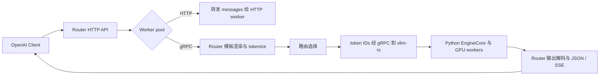

# 2026 年 9 月 tool calling 与 vLLM Router 变更阅读记录

整理日期：2026-10-07。研究仓库：[vllm](https://github.com/vllm-project/vllm)、[vllm-ascend](https://github.com/vllm-project/vllm-ascend)、[router](https://github.com/vllm-project/router)。

## 1. 时间与统计口径

- “整个九月”按当前日期理解为 **2026 年 9 月**。
- 采用 GitHub 的 **PR 合并时间（UTC）**，范围为 `2026-09-01 00:00:00 ≤ merged_at < 2026-10-01 00:00:00`。下列表格日期均为 UTC 月日；并非 PR 创建日期，也并非版本发布日期。
- 查阅仓库主页、GitHub PR 搜索结果与 PR 正文；通过 GitHub REST 搜索返回的 `pull_request.merged_at` 核对表格日期。对严格调用控制、Program 调度及 gRPC 后端进一步阅读 PR diff。
- vLLM / Ascend 按 tool calling、tool parser、DSML、strict、structural tag、output grammar、Responses、derender 等关键词交叉检索；Router 检索当月所有已合并 PR，共 **21 项**，产品变更和工程维护分别记录。
- 本文是主题变更记录，不是三个仓库所有提交的逐行审计。标题不含关键词且正文未关联到检索词的变更仍可能遗漏；纯模型推理内核、MoE 专家路由等不纳入 tool calling / 服务 Router。
- **已合并不等于已包含在某个安装包或 Ascend 镜像中**。发布分支回移单独注明，不把 vLLM main 的能力自动视为 Ascend 所有版本的能力。测试结果引用 PR 作者记录，本次没有运行 GPU/NPU 服务复现。

复查入口：[vLLM 九月已合并 PR](https://github.com/vllm-project/vllm/pulls?q=is%3Apr+is%3Amerged+merged%3A2026-09-01..2026-09-30)、[Ascend 九月已合并 PR](https://github.com/vllm-project/vllm-ascend/pulls?q=is%3Apr+is%3Amerged+merged%3A2026-09-01..2026-09-30)、[Router 九月已合并 PR](https://github.com/vllm-project/router/pulls?q=is%3Apr+is%3Amerged+merged%3A2026-09-01..2026-09-30)。

## 2. 主要结论

| 主题 | 九月变化 | 阅读或升级时的关注点 |
| --- | --- | --- |
| Tool calling 约束 | 增加服务端严格级别；MiMo 原生标签、DeepSeek V4.1 schema 约束及 Rust 完整输出 grammar 继续完善 | 区分调用外壳约束与参数 schema 约束；`required` 不代表所有原生标签工具参数都自动严格 |
| 模型解析 | DeepSeek DSML、Gemma4、Granite、Cohere、Inkling 等得到修复或重构 | 重点检查缺失标签、异常开头、参数空白和 reasoning → tool 边界 |
| API 一致性 | 修复并行调用开关、截断原因、多 choice 状态、Responses call ID 和流式最终响应 | Agent 往返调用、流式拼接和工具执行判定更可靠 |
| Ascend | 镜像内置 Rust tool parser；回移结构化输出和 DeepSeek V4 前端修复 | 变化分别涉及官方镜像、v0.26 兼容补丁及 v0.27 发布线 |
| Router | 新增 WASM OnRequest、Program Progress-TTL、Rust gRPC 后端、NIXL push 并发 P/D | Program 调度需要显式启用；gRPC 后端本次仍不支持主动工具调用 |
| Router 修复 | DP `@rank` GET 代理、重复响应头、Unicode stop 检查及 reasoning effort 兼容 | 多卡代理、非 ASCII 输出、客户端 API 兼容是本月明确修复点 |

## 3. vLLM：新特性与能力扩展

### 3.1 服务端严格调用级别

**09-18：[PR #56268](https://github.com/vllm-project/vllm/pull/56268)** 新增 `--tool-strict-level`，让服务端在客户端没有填写工具 `strict` 时也能设置约束下限。PR 同时更新 Python 和 Rust 路径。

| 级别 | 原生 structural-tag 路径的行为 |
| --- | --- |
| `auto`，默认 | 跟随 tool choice 与每个工具的 strict；required / named 激活标签，auto 在至少一个工具 strict=true 时激活 |
| `function` | 对带工具的请求提高调用外壳约束，限制标签和函数名；参数是否遵循 schema 仍取决于该工具 strict |
| `parameter` | 进一步约束所有工具的参数 schema，相当于每个工具 strict=true |

几个关键条件：`tool_choice="none"` 禁用工具调用；`auto` 即使激活 grammar 也允许普通文本回答；单个 strict 工具不会把其他工具的参数全部变严格；`VLLM_ENFORCE_STRICT_TOOL_CALLING=false` 优先于该选项并禁用 structural tags。使用通用 JSON schema 约束的 required / named 路径则继续约束声明的参数 schema。以上结论来自该 PR 的代码与文档 diff。[PR #56268](https://github.com/vllm-project/vllm/pull/56268)

### 3.2 模型、插件与 grammar 能力

| 日期 | 类型 | 变更与适用边界 | 来源 |
| --- | --- | --- | --- |
| 09-02 | 插件扩展 | reasoning / tool parser plugin 支持从 site-packages 按模块名导入，仍保留路径导入回退，方便通过 PyPI 分发 | [#45241](https://github.com/vllm-project/vllm/pull/45241) |
| 09-08 | 依赖兼容 | OpenAI SDK 下限提升为 `>=2.25.0`，支持 namespace tools 类型；不等于所有前后端路径都新增同等功能 | [#49104](https://github.com/vllm-project/vllm/pull/49104) |
| 09-12 | 重构兼修复 | Cohere reasoning / tool parser 合并为统一 `CohereCommandParser`，旧入口变为薄适配层，修复特殊 token 泄漏 | [#56392](https://github.com/vllm-project/vllm/pull/56392) |
| 09-18 | 依赖与约束 | Python XGrammar 升至 0.2.7，Rust structural-tag 库升至 0.3.0；采用上游 DeepSeek V4.1 builder，使参数 schema 约束一致可用 | [#57272](https://github.com/vllm-project/vllm/pull/57272) |
| 09-22 | Rust 基础重构 | 输出 grammar 改由已初始化的 parser 构建，引入覆盖范围接口和请求生命周期调整；主体是后续能力的基础，不能独立当成完整新功能 | [#55269](https://github.com/vllm-project/vllm/pull/55269) |
| 09-22 | Rust grammar | 基于 prompt 最终状态组合 reasoning 与可见输出 grammar，支持的分隔符型 parser 可从第一个生成 token 开始约束；包含 Qwen3、DeepSeek R1/V3、GLM45、Step 等，K3/Gemma4/Inkling/Harmony 当时仍列为后续工作 | [#57340](https://github.com/vllm-project/vllm/pull/57340) |
| 09-22 | Rust 模型支持 | 增加 MiMo V2.6 reasoning / tool parser，支持 `mimo-v2` 自动选择及显式 `mimo`；保留参数换行并按 schema 处理模板 None | [#57933](https://github.com/vllm-project/vllm/pull/57933) |
| 09-23 | 重构兼修复 | Granite 3.0/3.1 迁移到流式 Parser Engine，支持一处工具标记后的 JSON 调用数组拆成多调用，同时修复外围文本和流式问题；不覆盖 granite4 / granite-20b-fc | [#49648](https://github.com/vllm-project/vllm/pull/49648) |
| 09-25 | 相邻 reasoning 能力 | Granite 4.2 内置 `granite_thinking_parser`，无需单独提供插件；处理 thinking 切换和 content 前导换行，属于工具解析链路相关支持 | [#55957](https://github.com/vllm-project/vllm/pull/55957) |
| 09-29 | Python MiMo 严格调用 | 使用 MiMo 紧凑 XML 标签及保留参数空白的 parser 变体，支持 required / named 和并行开关；为当时固定的 XGrammar 0.2.7 提供兼容 builder | [#58019](https://github.com/vllm-project/vllm/pull/58019) |
| 09-30 | Rust MiMo 严格调用 | 从 Qwen3-Coder builder 切换到 MiMo builder，修复换行标签与紧凑标签不匹配；Rust structural-tag 库升至 0.4.1，**没有同时提升 Python 引擎 XGrammar 0.2.7 的 pin** | [#59148](https://github.com/vllm-project/vllm/pull/59148) |

### 3.3 拆分式前端：render / derender

这些是 **vLLM 前端接口变更**，与 Router 的 token-in 后端方向相关，但不能直接写成 Router 已集成的能力。

| 日期 | 变更 | 限制或注意点 | 来源 |
| --- | --- | --- | --- |
| 09-07 | 新增无状态 `POST /v1/responses/render`，返回给独立生成服务使用的 GenerateRequest，包含 prompt、工具元数据等预处理结果 | 无状态边界拒绝 previous_response_id；普通 serve 受 scale-out 开关控制；生成、状态存储与输出解析仍在 serving 层 | [#50195](https://github.com/vllm-project/vllm/pull/50195) |
| 09-18 | `/v1/chat/completions/derender` 支持流式 reasoning / content / tool_calls delta，此前配置 parser 会返回 400 | 没有实现 parser replay 缓存；PR 明确保留长流重复 replay 成本，使用 renderer 现有 executor | [#50550](https://github.com/vllm-project/vllm/pull/50550) |
| 09-21 | 补充流式 derender 与普通 chat 的一致性测试和文档 | 覆盖工具 ID 稳定性、reasoning、强制调用、多 token chunk、末尾无 token 的 finish reason；客户端需回传 stream_state | [#57922](https://github.com/vllm-project/vllm/pull/57922) |
| 09-24 | 普通流式 derender 的增量 detokenization 移至 renderer executor | 修复同步 CPU 工作阻塞 FastAPI event loop 的执行位置问题，不改变输出协议 | [#57528](https://github.com/vllm-project/vllm/pull/57528) |
| 09-29 | 普通流式 chat / completion derender chunk 附带解析后的 logprobs，维护跨 chunk 解码上下文和 offset | **parser-aware reasoning/tool 路径的 logprobs 仍在该 PR 中列为后续工作**，不能据此认为所有 derender 流都支持 | [#55029](https://github.com/vllm-project/vllm/pull/55029) |

## 4. vLLM：bug 修复与行为变化

### 4.1 DeepSeek、Gemma、Step 与 Inkling 解析

| 日期 | 问题 → 修复后行为 | 来源 |
| --- | --- | --- |
| 09-02 | DeepSeek DSML 漏掉参数结束标签会吞掉下一参数 → 下一参数开始时隐式关闭前一个；共享转换也作用于 V3.2 | [#54838](https://github.com/vllm-project/vllm/pull/54838) |
| 09-09 | DeepSeek V4 长上下文偶发漏掉 tool_calls 外层开头，invoke 块泄漏为正文 → 能识别无外层 wrapper 的完整调用；**V4/V3.2 完整工具块后的尾随文本改为丢弃** | [#55954](https://github.com/vllm-project/vllm/pull/55954) |
| 09-10 | DeepSeek V4 的 toolcalls / tool 等错误 wrapper 开头无法匹配 → 容忍这些拼写异常，属于相关问题的部分修复 | [#56141](https://github.com/vllm-project/vllm/pull/56141) |
| 09-11 | Rust DeepSeek V4/V4.1 assistant 工具参数编码偏离 recipe → JSON object 拆成 DSML 参数，非 object 或无效 JSON 作为 string=true 的 arguments 原样保存 | [#56260](https://github.com/vllm-project/vllm/pull/56260) |
| 09-15 | Gemma4 裸 `:name` 开头丢调用，缺 `{` 时函数名吞掉后续内容 → 接受裸冒号开头，并在工具结束符处退出异常 name 状态 | [#53444](https://github.com/vllm-project/vllm/pull/53444) |
| 09-18 | DeepSeek V4 请求 tools 总会新增 system 消息 → 优先附加到首个已有 system，只在不存在时合成，Python renderer 与 Rust / reference 对齐 | [#51856](https://github.com/vllm-project/vllm/pull/51856) |
| 09-26 | Inkling reasoning 后工具函数名泄漏到流式 content → 延迟相应 reasoning end 的交接，等待下一块类型边界 | [#58792](https://github.com/vllm-project/vllm/pull/58792) |
| 09-29 | Step3p5 named / required 走通用 JSON 路径，出现 XML 参数或提取不到调用 → 通过原生 XML parser 处理强制调用 | [#51810](https://github.com/vllm-project/vllm/pull/51810) |

### 4.2 schema、tool choice 与并行调用

| 日期 | 问题 → 修复后行为 | 来源 |
| --- | --- | --- |
| 09-27 | response_format 与 tool_choice=auto 同时存在时约束冲突 → 将普通结构化回答与合法工具调用组合为 OR，保留两种输出可能 | [#56086](https://github.com/vllm-project/vllm/pull/56086) |
| 09-29 | Cohere 工具 schema 的 $defs/definitions 被嵌套后，根锚定 $ref 失效并返回 500 → 将 definitions 提升到组合 schema 根部 | [#49602](https://github.com/vllm-project/vllm/pull/49602) |
| 09-29 | GLM 等原生 XML / structural-tag parser 被 generic required/named JSON schema 强制干预 → 对声明不使用通用 required/named 路径的 parser 跳过 JSON 注入 | [#47512](https://github.com/vllm-project/vllm/pull/47512) |
| 09-29 | required 通用工具数组 grammar 无上限，parallel_tool_calls=false 仍生成多调用再丢弃 → 显式 false 时设置 maxItems=1，从生成阶段限制；named 路径不受此数组修改影响 | [#50502](https://github.com/vllm-project/vllm/pull/50502) |
| 09-29 | 非 Harmony Responses 没有执行并行调用过滤 → 流式和非流式复用过滤逻辑，显式 false 只保留首个，流式 output_index 连续；null / unset 不按 false 处理 | [#59298](https://github.com/vllm-project/vllm/pull/59298) |
| 09-29 | Rust XML 参数类型转换过严或复合类型不准确 → 非 string 去外围空白，数字支持合法下划线，nullable 支持 null；object/array 仅解码对应类型 | [#59004](https://github.com/vllm-project/vllm/pull/59004) |
| 09-30 | named 工具 parameters=None 或 {} 允许自由文本/任意 JSON 值 → Chat 和 Responses 统一归一为无声明属性的 object schema，保证参数是 JSON object | [#45290](https://github.com/vllm-project/vllm/pull/45290) |

### 4.3 流式、截断与 parser 状态

| 日期 | 问题 → 修复后行为 | 来源 |
| --- | --- | --- |
| 09-01 | 未完成工具开头在非流式返回原始 markup，流式却丢弃 → engine-based auto 路径采用工具 parser 清洗后的 content；同时处理延迟正文顺序及未配置 reasoning parser 的透传 | [#47562](https://github.com/vllm-project/vllm/pull/47562) |
| 09-09 | Rust 对模型分隔符与正文空白处理不精确 → 按模型模板消耗 framing，保留正文/参数空白，roundtrip 不再依靠 trim 掩盖差异 | [#55417](https://github.com/vllm-project/vllm/pull/55417) |
| 09-09 | Seed-OSS 继承不存在于词表的 ChatML turn boundary，当前轮范围判断失效 → 使用 seed:bos / seed:eos 并补充 fallback 测试 | [#54264](https://github.com/vllm-project/vllm/pull/54264) |
| 09-10 | Rust unified / split parser 解析顺序不一致，例如 Kimi K3 匹配到宽泛 kimi → 统一选择逻辑并优先 unified registry | [#56018](https://github.com/vllm-project/vllm/pull/56018) |
| 09-15 | reasoning end 的 token 判断与 grammar 分别维护 → 从 engine grammar 推导共享结束事实，减少结构化输出与流式初始化判断的分歧，主要属于重构 | [#56200](https://github.com/vllm-project/vllm/pull/56200) |
| 09-16 | 混合 tool call / think end 的 delta 丢正文，新轮 reasoning 判定缺少 boundary guard → 使用结束 token IDs 与 turn boundary 修复反向扫描 | [#56635](https://github.com/vllm-project/vllm/pull/56635) |
| 09-23 | max_tokens 截断工具参数，流式仍报 tool_calls → 仅正常 stop 改写为 tool_calls；截断保留 length，避免客户端误执行残缺 JSON | [#46303](https://github.com/vllm-project/vllm/pull/46303) |
| 09-25 | parser 吞掉控制 token 对应的流式 delta 时，logprobs 也被丢弃 → 请求 logprobs 时仍发空 delta chunk 保留信息；隐藏 reasoning 的既有过滤优先 | [#58583](https://github.com/vllm-project/vllm/pull/58583) |
| 09-28 | 非流式 n>1 共用 parser，工具 ID 计数跨 choice 泄漏 → 每个后续 choice 创建独立 parser，与流式对齐 | [#58939](https://github.com/vllm-project/vllm/pull/58939) |

### 4.4 Responses、MCP 与 Anthropic 协议

| 日期 | 问题 → 修复后行为 | 来源 |
| --- | --- | --- |
| 09-01 | MCP SDK 2.x 工具 input schema 兼容问题 → 支持新版 schema 接口 | [#53870](https://github.com/vllm-project/vllm/pull/53870) |
| 09-09 | 非 Harmony 对 SDK 接受但服务未实现的输入项出现内部错误 → 对 item_reference、computer_call_output、mcp_call 等返回明确 input 参数 400；**不是新增这些输入项的执行支持** | [#55974](https://github.com/vllm-project/vllm/pull/55974) |
| 09-11 | browser.find 使用旧 action literal，引发新 SDK Pydantic 校验错误 → 使用 find_in_page，同步修复 Harmony 转换和流式事件 | [#55305](https://github.com/vllm-project/vllm/pull/55305) |
| 09-14 | DeepSeek V4.1 tokenizer 未统一 Responses input_text / output_text → 按普通 text 内容渲染，完善相关 API 前端兼容 | [#56299](https://github.com/vllm-project/vllm/pull/56299) |
| 09-16 | 多 MCP session 重复注册 cleanup，可能重复清理或访问已关闭 session → 所有 session 打开后统一注册一次，在关闭前执行；不修复另一个跨 task cancel-scope 问题 | [#56988](https://github.com/vllm-project/vllm/pull/56988) |
| 09-25 | Harmony 内置工具循环后续轮忽略 max_output_tokens，改用剩余上下文长度 → 后续轮复用 get_max_tokens，遵守请求和服务端生成上限；不据此认定实现了跨轮总预算扣减 | [#58551](https://github.com/vllm-project/vllm/pull/58551) |
| 09-28 | 实验 parser context 的多轮调用只计首轮 reasoning tokens → 各轮单独统计后求和；PR 复现由 34 修正为 34+35=69 | [#58927](https://github.com/vllm-project/vllm/pull/58927) |
| 09-29 | 内置工具输出随机生成新 call_id，下一轮无法对应原调用 → MCP code interpreter / web search / container 及本地 demo 路径保留来源 call_id，输出 item 自身 id 仍独立 | [#55596](https://github.com/vllm-project/vllm/pull/55596) |
| 09-30 | 非 Harmony 流式 completed 再解析导致 item id / call_id 改变、丢项或 logprobs 错配 → 从已流出的 items 构建最终响应，零参数 delta 的调用也发 arguments.done | [#59307](https://github.com/vllm-project/vllm/pull/59307) |
| 09-30 | Anthropic named 调用已有 tool_use block，但 stop_reason=end_turn → 流式/非流式均根据实际工具调用返回 tool_use，避免客户端跳过执行 | [#47598](https://github.com/vllm-project/vllm/pull/47598) |

### 4.5 相关性能优化

**09-08：[PR #55223](https://github.com/vllm-project/vllm/pull/55223)** 将结构化输出 reasoning gate 对全历史的重复扫描改为扫描新增 decode / speculative window。仅适用于可以安全推导单 token reasoning end IDs 的 parser，否则保留旧逻辑。作者在 DeepSeek-V4-Flash、8×H100 的 A/B 中报告 `structural_tag + MTP` TPOT p50 从 45.772ms 降到 18.175ms；这是该特定 workload 的结果，不是所有 tool calling 请求的统一收益。

## 5. vLLM Ascend：直接相关变更

| 日期 | 类型/分支 | 变化与意义 | 来源 |
| --- | --- | --- | --- |
| 09-01 | 镜像能力 | 所有 Ascend Dockerfile 安装 protobuf 编译器并构建 _rust_tool_parser，官方镜像内置 Rust 工具解析前端；作者验证 MiniMax M3 parser 启动及 Qwen3.5 Python 前端调用 | [#15156](https://github.com/vllm-project/vllm-ascend/pull/15156) |
| 09-02 | vLLM 0.26 兼容补丁 | 通过 Ascend patch 层回移结构化输出修复：按实际接受的 speculative token 窗口推进 FSM、记录 reasoning end，边界位于 draft 中间时先验证再推进 grammar；保持固定 vLLM 源码不变 | [#15433](https://github.com/vllm-project/vllm-ascend/pull/15433) |
| 09-09 | releases/v0.27.1rc 回移 | 回移 Ascend #14632 的四个提交，修正 DeepSeek V4 模板渲染、reasoning effort、兼容处理和长工具参数增量流式输出，并解决补丁注册冲突 | [#16115](https://github.com/vllm-project/vllm-ascend/pull/16115) |

Ascend #15433 涉及上游 [vLLM #44993](https://github.com/vllm-project/vllm/pull/44993)、[#53046](https://github.com/vllm-project/vllm/pull/53046) 的修复；相关 logger 初始化在固定 0.26 源码中已经存在。这里记录的是 **九月发生的 Ascend 回移**，不把来源 PR 算作 vLLM 九月新增项。类似地，#16115 引用的 [Ascend #14632](https://github.com/vllm-project/vllm-ascend/pull/14632) 是回移来源，不作为本表额外九月变更计数。

检索中出现的 DeepSeek hash-router bias、MoE gate / 专家路由修复属于模型内部路由，不是 vllm-project/router 的服务路由器，未混入本主题。

## 6. vLLM Router：新特性

### 6.1 WASM 可插拔 OnRequest 中间件

**09-16：[PR #251](https://github.com/vllm-project/router/pull/251)** 引入 Wasmtime host 和 `vllm:router-middleware@0.1.0` WIT。通过 `--wasm-middleware`、`--wasm-middleware-sha256`、`--wasm-middleware-route` 配置；默认接入点为 `POST /v1/chat/completions`，显式启用，未支持的 route 启动时拒绝。

中间件在请求到 worker 前修改或拒绝请求，提供摘要 pinning、有界 worker/queue 和 fail-closed 错误处理。附带示例 guest；测试覆盖修改、拒绝及路径隔离。它是请求进入阶段的插件机制，不代表已经提供任意响应阶段 hook。[PR #251](https://github.com/vllm-project/router/pull/251)

### 6.2 有界 tokenizer L0 编码缓存

**09-18：[PR #270](https://github.com/vllm-project/router/pull/270)** 新增 `CachedTokenizer`，对固定配置、确定性 tokenizer 的完全相同 encode 输入复用完整 Encoding。LRU 同时受 entry 数与估算字节上限约束，过大结果和错误不缓存，编码与克隆在锁外完成，提供命中、淘汰等指标。

**本次只加入库 wrapper，请求路径集成和 CLI 选项仍是后续工作。** 它不是 GPU KV cache，也不同于 gRPC 后端的“模型 → 已加载 tokenizer/frontend”对象缓存。batch encode、decode 和 metadata 调用仍透传。[PR #270](https://github.com/vllm-project/router/pull/270)

### 6.3 Program-level Progress-TTL 调度

**09-24：[PR #286](https://github.com/vllm-project/router/pull/286)** 把连续 `LLM → tool call → LLM` 交互作为一个 Program，在工具执行暂停期间利用连续性、重算成本与容量信息决定保留、恢复和放置请求，目标是降低短工具往返丢失可复用 KV 的概率。

主要组成：身份归一化（agentic_context、兼容 hints 和 headers）、Program registry、RequestPool、初始 Rank 绑定策略、容量/吞吐估计、Progress-TTL、避免饥饿的恢复机制、backend polling、诊断和 Prometheus 指标。默认 Rank 内恢复顺序为 MRU，可选 FCFS；跨 Rank 放置受全局队列和容量门控约束。[PR #286](https://github.com/vllm-project/router/pull/286)

启用边界来自 PR diff：Rust/Python CLI 都使用 `--enable-program-scheduling` 显式启用，`--program-scheduling-config-json` 可覆盖配置；不带启用开关却提供该 JSON 会被拒绝。未启用或没有支持的 Program 身份时回到原请求路由路径。成本模型系数需要结合模型、硬件和并行配置校准。[PR #286](https://github.com/vllm-project/router/pull/286)

**职责边界：调度器控制请求 admission 和 placement，不代表推理引擎已执行物理 KV eviction / offload / prefetch。** PR 明确将带执行反馈的 Router → engine KV 控制留待后续，不能把“TTL 到期”直接解释为 GPU KV 已释放。[PR #286](https://github.com/vllm-project/router/pull/286)

### 6.4 Rust gRPC Engine-Client 后端

**09-24：[PR #283](https://github.com/vllm-project/router/pull/283)** 新增面向同构 gRPC worker pool 的 Rust chat frontend：Router 应用模板并 tokenize，发送 token IDs 到 `vllm-rs` 的 Inference.GenerateStream，然后 detokenize 并转换为 OpenAI JSON / SSE。

Router 复用 vLLM 0.29.0 的 vllm-chat、vllm-tokenizer、vllm-text，使用 vllm-proto 0.2；不加载模型权重。token 预处理在 policy 前完成，重试复用 PreparedChat；gRPC worker 使用实际 gRPC health 探测。ZMQ 属于 vllm-rs 与 EngineCore 的内部边界，不是 Router 直接连接 EngineCore。[PR #283](https://github.com/vllm-project/router/pull/283)

| 当月后端支持边界 | 状态 |
| --- | --- |
| 文本生成、文本历史、已有工具调用/工具响应的模板渲染 | 支持 |
| tools + tool_choice=none 的历史表达 | 支持 |
| 主动 tool calling、reasoning_effort | 拒绝；diff 明确返回 400，等待输出 parser 接入 |
| 多模态、n>1、chat logprobs、请求级自定义模板、旧 functions/function_call | 此 gRPC 路径不支持 |
| HTTP / gRPC 混合 worker pool | 拒绝，要求同构 |
| token-aware prefix routing | 预处理边界已准备，本文所读 PR 没有完成该策略集成 |

以上限制见 [PR #283](https://github.com/vllm-project/router/pull/283) 的兼容性说明和请求校验 diff。**vLLM 自身新增 parser 并不意味着 Router gRPC 路径自动获得主动工具调用能力。** 使用该路径前还需确认 vllm-rs / Python EngineCore 发布线匹配。

### 6.5 NIXL push 模式支持与 P/D 时序改进

**09-24：[PR #187](https://github.com/vllm-project/router/pull/187)** 针对 NIXL push 改为并发发送 prefill 和 decode 请求，避免串行路径让 decode 登记总是落在 prefill 完成后、引入额外 push 触发消息。Router 从首个响应学习并缓存 prefill 信息，配合 `--kv-connector nixl`，worker 侧需要兼容的 `transfer_mode: push`。

作者基准中并发 8 时 TTFT 从原 push 的 184ms 降至 parallel push 的 123ms；该收益取决于其 P/D 配置与 workload，不能直接推广到所有 NIXL 部署。这是服务路由与 KV 传输协议配合的改进，和 JSON 工具调用解析是不同层面。[PR #187](https://github.com/vllm-project/router/pull/187)

## 7. Router：bug 修复

| 日期 | 触发条件与原问题 | 修复后的行为 | 来源 |
| --- | --- | --- | --- |
| 09-11 | 节点内 DP worker URL 带 @rank，GET 代理将它作为 URL userinfo，/v1/models 等可能返回 500 | 移除 rank 后缀并通过 X-data-parallel-rank header 传递；修复 models / health_generate / server_info / model_info，health 原本正常 | [#221](https://github.com/vllm-project/router/pull/221) |
| 09-14 | reasoning_effort 只接受 low/medium/high，其他兼容值在 Router 反序列化时 400 | 接受 none/minimal/low/medium/high/xhigh/max，覆盖 Chat 与 Responses；具体模型是否支持由 backend 决定 | [#234](https://github.com/vllm-project/router/pull/234) |
| 09-14 | partial stop 按任意字节切片，遇到 é/emoji 等可能 UTF-8 panic | 按 char_indices 有效字符边界检查，保留最长可能 stop 前缀并正确释放不匹配文本 | [#272](https://github.com/vllm-project/router/pull/272) |
| 09-14 | 同名多值响应 header 使用 insert 覆盖，只留下最后一项，如多个 Set-Cookie 丢失 | 改用 append，按原顺序保留重复值，仍过滤相应 hop-by-hop headers | [#271](https://github.com/vllm-project/router/pull/271) |

## 8. Router：其余九月已合并项

下表加上前述 5 个能力 PR 和 4 个产品 bugfix，覆盖 Router 当月检索到的 21 个已合并 PR。以下多数属于维护工作，不按工具调用新功能描述。

| 日期 | 类别 | 内容 | 来源 |
| --- | --- | --- | --- |
| 09-08 | CI 修复 | 修复 EOL Bullseye 基础镜像导致的 CI 失败 | [#246](https://github.com/vllm-project/router/pull/246) |
| 09-14 | 清理 | P/D router 小范围代码清理 | [#227](https://github.com/vllm-project/router/pull/227) |
| 09-14 | 重构 | 简化 CLI 参数解析 | [#228](https://github.com/vllm-project/router/pull/228) |
| 09-16 | CI | rustfmt、clippy、Python 格式等快速检查从 Buildkite 迁移至 GitHub Actions | [#282](https://github.com/vllm-project/router/pull/282) |
| 09-16 | CI | 4 GPU P/D 测试迁至 EKS l4-k8s | [#276](https://github.com/vllm-project/router/pull/276) |
| 09-23 | 发布 | nightly 之外增加输入 X.Y.Z 的版本化 Docker 发布流程；本项不证明已发布某个具体版本 | [#304](https://github.com/vllm-project/router/pull/304) |
| 09-23 / 09-24 | 测试修复 | 放宽 api_endpoints_test.rs 的 worker 启动超时，修复并行 CI 下 mock worker 来不及健康就绪的失败；属于测试超时修正 | [#305](https://github.com/vllm-project/router/pull/305)、[#307](https://github.com/vllm-project/router/pull/307) |
| 09-08 / 09-11 / 09-21 / 09-30 | 社区文档 | 增加社区链接和更新微信群二维码 | [#245](https://github.com/vllm-project/router/pull/245)、[#267](https://github.com/vllm-project/router/pull/267)、[#293](https://github.com/vllm-project/router/pull/293)、[#329](https://github.com/vllm-project/router/pull/329) |

## 9. 建议的代码阅读顺序

1. **工具调用约束**：从 #56268 的严格级别判断开始，再看 #50502 的 maxItems 和 #56086 的联合约束，最后串到 #55269 → #57340 的 Rust parser-owned grammar 生命周期。
2. **解析与输出**：围绕 #54838 / #55954 / #53444 阅读模型 FSM 的容错，再看 #47562 / #46303 / #58939 的 content、finish_reason 和独立 parser 状态。
3. **Agent 往返协议**：#55596 的来源 call_id → #59307 的流式最终响应一致性 → #59298 的并行调用限制 → #56988 的工具 session 生命周期。
4. **Router 的 Agent 调度**：#286 中先读 identity/contracts、RequestPool 和 state，再读 TTL policy、resume placement、HTTP integration 与 diagnostics；始终区分调度决策和实际 KV 操作。
5. **Router 的 token-in 路径**：#283 中读 detect → frontend/preprocess → convert → grpc/openai → health；对照 #270，区分 frontend 对象缓存、encode 结果缓存和 EngineCore KV cache。
6. **P/D 通信**：#187 的并发两阶段请求，再结合 worker 侧 NIXL push 注册/触发时序理解为何降低额外等待。

这些顺序是基于上述变更的阅读建议，并非上游规定。具体文件入口可从各 PR 的 Files changed 查到，避免把持续变化的 main 文件内容当成九月合并时的源码。

## 10. 未计入已落地能力的内容

- [Router roadmap #244](https://github.com/vllm-project/router/issues/244) 和相关 RFC 用来解释设计背景，不能代替合并实现。
- [vLLM #55540](https://github.com/vllm-project/vllm/pull/55540) 描述 Responses 内置工具的 malformed JSON 自动重试修复；本次检查 `merged=false`，没有计入九月已落地 bugfix。它与已合并的 #55596 call ID 修复相关，但两者不是同一能力。
- vLLM parser、Responses 和 derender 的改进没有逐一在 Router gRPC adapter 中实现；该 adapter 对主动工具调用的拒绝仍是本文核对到的限制。
- 本文未逐项推断“首次包含此 PR 的 release tag”。升级时应按 PR merge commit 与实际发布分支、镜像构建依赖确认，而不能只看月份。
